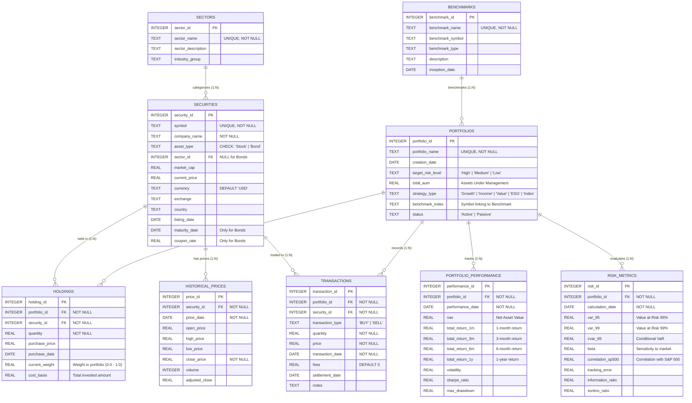

# 🗄️ Database Entity-Relationship Diagram (ERD)

This document visualizes the database schema for the **Portfolio Analytics Agent**, including all 9 tables, fields, data types, primary keys (PK), foreign keys (FK), and relationship cardinalities.

---

## 📊 Complete Mermaid ERD



---

## 🔍 Key Relational Insights for Queries & Calculations

### 1. **Sector Exposure Calculation Join Path**
```
PORTFOLIOS (portfolio_id / portfolio_name)
    ↓ (1:N)
HOLDINGS (current_weight, quantity)
    ↓ (N:1)
SECURITIES (asset_type == 'Stock', sector_id)
    ↓ (N:1)
SECTORS (sector_name)
```
* **Filter:** `securities.asset_type = 'Stock'` (bonds have `sector_id IS NULL`).
* **Aggregation:** `SUM(holdings.current_weight)` grouped by `sectors.sector_name`.

### 2. **Portfolio Valuation & Holdings Query**
```sql
SELECT 
    p.portfolio_name,
    s.symbol,
    s.company_name,
    sec.sector_name,
    h.quantity,
    s.current_price,
    (h.quantity * s.current_price) AS market_value,
    h.current_weight
FROM portfolios p
JOIN holdings h ON p.portfolio_id = h.portfolio_id
JOIN securities s ON h.security_id = s.security_id
LEFT JOIN sectors sec ON s.sector_id = sec.sector_id
WHERE p.portfolio_name = 'Tech Innovation Fund';
```

### 3. **Performance & Risk Tracking Path**
* `PORTFOLIOS` connects 1:N to `PORTFOLIO_PERFORMANCE` (keyed on `portfolio_id, performance_date`).
* `PORTFOLIOS` connects 1:N to `RISK_METRICS` (keyed on `portfolio_id, calculation_date`).
